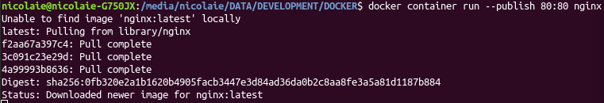

# Containere

Sunt blocurile constructive. Acestea sunt simple procese pe mașina locală. Un container nu este o mașină virtuală. Dacă inițiezi o interogare a proceselor care rulează pe mașină, vei vedea și containerele apărând ca procese ale mașinii gazdă. Concluzia este că un container nu este *găzduit* într-o mașină virtuale. Pur și simplu sunt integrate cu restul proceselor care rulează pe mașină. Putem spune că un container este un proces care rulează pe mașina gazdă. Izolarea containerelor de restul mașinii se realizează prin gestionarea *namespace*-urilor și a *cgroup*-urilor.

Lucrul care individualizează Docker de restul tehnologiilor de virtualizare este că poți constitui containere care se comportă identic și în momentul în care le introduci în producție.

Docker ia o aplicație pe care o ambalează într-un sistem de fișiere numite generic layers. Aceste straturi conțin tot ce este necesar rulării aplicației (binare și biblioteci de cod). Containerele oferă și posibilitatea de a izola aplicațiile între ele oferindu-le și un nivel de protecție. Aceste aspecte oferă aspectul de container. Un container este o instanță a unei imagini. Imaginile sunt construite (`docker build`) folosind fișiere `Dockerfile`, care configurează și parametrizează mediul de rulare și codul scris de tine.

Un container rulează pe o singură mașină. Un container este un grup de procese. Procesele rulează în arbori și acest lucru implică faptul că pentru un container există un proces rădăcină.

Un container poate fi conectat la una sau mai multe rețele. I se poate atașa un mediu de stocare sau se poate crea o nouă imagine pe baza stării sale curente. Funcționarea containerelor se leagă de tehnologia prin care se realizează `namespaces`. Acestea oferă spațiile de lucru protejate care sunt, de fapt folosite la rularea containerelor. Fiecare container creează un set de `namespaces`. Aceste namespaces oferă niveluri de izolare pentru diferitele componente care rulează în container. Docker engine combină namespace-urile, control group-urile și UnionFS într-o unitate numită *format de container*.

Într-un container, toate aplicațiile rulează ca root. Un cont de root din container nu este contul de root al mașinii gazdă. Pentru a elimina problemele ce țin de securitate, se recomandă rularea aplicațiilor în containere sub un user creat, nu sub root.

## Detalii tehnice

Tehnologia containerelor din Docker izolează un proces căruia îi oferă din resursele mașinii gazdă. Docker folosește pentru a realiza această izolare un sistem de fișiere numit OverlayFS care poate distribui resursele mașinii gazdă între diferitele containere.

Mai întâi de orice, cel mai bine este să te asiguri că poți vorbi cu serviciul `docker` interogând consola cu `docker version`. Dacă totul este în regulă și nu ai erori, poți afla mai multe despre instalarea docker: `docker info`.

O imagine este aplicația pe care dorești să o rulezi. Un container este procesul în care rulează instanța imaginii. Poți rula mai multe containere care să ruleze aceeași imagine. Imaginile se obțin din *registries*, care sunt depozite digitale de imagini - hub.docker.com. Pentru a ține evidența imaginilor, Docker a dezvoltat un sistem similar Git.

Imaginile Docker sunt template-uri read-only și nu au nicio stare asociată. Pur și simplu sunt niveluri de fișiere hard-coded care pot fi citite și atât. O imagine ar fi destul de limitată dacă nu am putea interacționa cu ea pe un nivel care să permită și scrierea. Rolul containerelor este acela de a asigura un nivel de interacțiune read-write. În acest caz, dacă se va distruge containerul, conținutul care a fost pus pe nivelul read-write, va fi pierdut. Pentru a păstra ceea ce s-a făcut, se vor crea volume.

Containerele pot fi oprite, pornite și repornite cu `start`, `stop` și `restart`. La un stop ceea ce se întâmplă este trimiterea unui SIGTERM (-15) procesului intern principal al containerului. Motorul Docker așteaptă o închiderea a procesului intern după perioada de grație, iar dacă acest lucru nu se petrece, va fi emis un SIGKILL (-9), ceea ce va conduce la o încheiere abruptă a execuției procesului intern, dar fără o curățare corespunzătoare.

Buna practică spune că un container ar trebui să ruleze doar un singur proces/aplicație/serviciu. Este vorba despre realizarea unei arhitecturi de microservicii - MSA (Microservices Architecture). Din aceste considerente, viața unui container este strâns legată de procesul/serviciul/aplicația care-l rulează. Atunci când procesul care rulează în container se oprește din diferite motive, containerul este oprit și el.

## Numirea containerelor

Putem numi noi containerele cum dorim. În momentul rulării subcomenzii `run`, containerul va fi pornit, dar i se va da un nume arbitrar. Folosirea opțiunii `--name nume_container` va denumi containerul care tocmai rulează.

```bash
docker container run --publish 80:80 --detach --name kosson-starter-kick nginx
```

Rezultatul va fi că în listă va apărea containerul numit înadins.

```bash
$ docker container ls
CONTAINER ID        IMAGE               COMMAND                  CREATED             STATUS              PORTS                NAMES
c6e614f7c8ad        nginx               "nginx -g 'daemon of…"   9 seconds ago       Up 8 seconds        0.0.0.0:80->80/tcp   kosson-starter-kick
```

Numirea containerelor este foarte importantă pentru că are urmări în ceea ce privește stabilirea unei rețele între mai multe posibile containere.

## Rularea unui container

Atunci când dorim rularea unui container, se va folosi comanda `docker container run`. Acestă comandă va căuta imaginea căreia devine gazdă și dacă nu găsește acea imagine într-un `cache` dedicat de pe mașina locală, va proceda la descărcarea acesteia de pe net (Docker Hub). De exemplu, pentru a rula un server web Nginx, tot ce este nevoie este să-l inițiezi și în spate vor fi descărcate toate resursele necesare.

```bash
docker container run --publish 80:80 nginx
```

Acest lucru este echivalentul unei comenzi separate `docker pull nginx`.

Imaginea va fi descărcată și plasată în cache-ul de imagini de pe mașina locală. Dacă nu specifici o versiune a imaginii, va fi descărcată cea mai nouă. Imaginea va beneficia de un IP generat intern de rețeaua pe care `docker` o stabilește în spatele cortinei și va deschide portul specificat. Dacă nu este specificat `--publish`, portul nu va fi deschis. O formulare `80:80` va lua portul de pe mașina gazdă și va forwarda traficul pe portul 80 al containerului.

Comanda de mai sus va descărca și instanția un server nginx care va fi activat pe porturile specificate de îndată ce este descărcat.



În acest moment ai acces la server. Dacă portul pe care activezi serverul este deja folosit de altă aplicație (*Error starting userland proxy: listen tcp4 0.0.0.0:8080: bind: address already in use*), poți specifica în stânga celor două puncte un port liber pe care cererile să fie ascultate urmând să fie preluate de server ca și cum ar fi venit de pe portul `80`.

```bash
docker container run --publish 8080:80 nginx
```

Ceea ce tocmai ai realizat este să asculți cererile care vin pe 8080 de la mașina locală și să le forwardezi pe portul intern 80 al containerului. La nevoie poți specifica ce versiune a imaginii trebuie să folosești și dacă este necesar ce comandă de inițializare a respectivului serviciu.

```bash
docker container run --publish 8080:80 nginx:1.11 nginx -T
```

Lucrând cu serverul proaspăt instalat vei vedea toate apelurile în consolă ca loguri. Din nefericire, aplicația va ține o consolă ocupată. Pentru a rezolva acest lucru, va trebui pornit dokerul cu directiva `detach` activată care va trimite rularea containerului în background.

```bash
docker container run --publish 80:80 --detach nginx
```

Va fi returnat un identificator unic pentru containerul care rulează nginx. De fiecare dată când vei rula câte un container, va fi returnat un id unic pentru acel container.

### Dockerfile

Chiar dacă poți rula un container separat, ceea ce face din Docker o tehnologie cu adevărat demnă de atenție este faptul că poți parametriza funcționarea containerului printr-un fișier dedicat numit `Dockerfile`. Acest lucru presupune că vei folosi o imagine deja existentă, nu una pe care să o construiești de la 0. Un exemplu de rulare a unei aplicații de Python pe care-l oferă documentația.

```yaml
# Folosești un runtime oficial drept punct de construcție a noii imagini
FROM python:2.7-slim
# Setezi directorul în care vei pune resursele aplicației la /app
WORKDIR /app
# Copiezi conținutul directorului curent al aplicației în /app
COPY . /app
# Instalezi pachetele și dependințele specificate în  requirements.txt
RUN pip install --trusted-host pypi.python.org -r requirements.txt
# MExpui portul 80 al containerului către exterior
EXPOSE 80
# Definești variabile de mediu
ENV NAME World
# Rulezi fișierul app.py atunci când containerul va porni
CMD ["python", "app.py"]
```

Fișierul `Dockerfile.yml` trebuie să fie chiar unde sunt cele două resurse `app.py` și `resources.txt` pentru a se face copierea.

### Lansarea unui container ca daemon

La momentul rulării unei imagini, dacă nu adaugi `--detach` sau mai simplu `-d`, terminalul sau consola vor fi blocate. Folosirea lui detach va debloca consola pentru a putea fi utilizată și pentru alte operațiuni. Pentru a rula un container ca un daemon, trebuie să-l detașăm de terminalul care l-a pornit. Pentru aceasta avem subcomanda `detach`, care poate fi pasat subcomenzii `run` drept opțiune.

```bash
docker run -d busybox
```

### Rularea în mod interactiv

Ceea ce se întâmplă atunci când rulezi un container este că o imagine este luată drept input și este lansată ca un container. Un container poate rula în modul interactiv dacă comenzii `run` îi sunt adăugate fanioanele `-t` și `-i`. Fanionul `-i` este cel care face rularea containerului în mod interactiv. Ceea ce se petrece în spate este o capturare a input-ului standard al acelui container (STDIN-ul). Fanionul `-t` alocă un pseudo-terminal (TTY) pe care îl atribuie containerului tocmai pornit.

```bash
sudo docker run -i -t ubuntu:18.04 /bin/bash
```

Să analizăm comanda de mai sus. Dacă imaginea de Ubuntu nu există, va fi descărcată automat, fiind echivalentul unei comenzi `docker pull ubuntu`. Imediat ce a fost descărcată, se va crea automat containerul prin instanțierea sa. Acest pas este echivalentul comenzii CLI `docker container create`. Este adăugat un layer final read-write ceea ce permite operațiuni cu sistemul său local de fișiere. Următorul pas este să creeze o interfață de rețea pentru a conecta containerul la rețeaua default. Privind la comandă, nu a fost specificată nicio opțiune privind rețeaua. Acest pas implică și alocarea unei adrese IP containerului. Containerele se pot conecta la rețele externe folosind conectarea la rețeaua gazdei. În acest moment `docker` pornește containerele și execută comanda specificată `/bin/bash`. Dacă termini sesiunea de bash, containerul va fi oprit, dar nu va fi scos din lucru.

Putem să închidem sesiunea interactivă fără a opri funcționarea containerului prin combinațiile succesive `CTRL + P` urmat de `CTRL + Q`. TTY-ul va fi deconectat de la container. Atenție, containerul va continua să funcționeze.

De exemplu:

```bash
sudo docker run -i -t busybox
# urmat de o detașare CTRL + P plus CTRL + Q
sudo docker ps
#CONTAINER ID IMAGE      COMMAND  ... NAMES
#028ea693bcc2 busybox   "sh"     peaceful_goldwasser
```

La nevoie poți să reatașezi containerul de la care te-ai deconectat cu `sudo docker attach numeledinps`.

```bash
sudo docker attach peaceful_goldwasser
```

### Obținerea unui shell în container

```bash
docker container run -it
```

Opțiunea `-t` îți oferă un pseudo-TTY. Opțiunea `-i` permite menținerea deschisă a unei sesiuni.

```bash
docker container run -it --name webserv nginx bash
```

Vei obține un acces root în container. Pentru a ieși din shell, dai `exit`. Fii foarte atent că rularea containerului este legată de rularea comenzii. Dacă ai ieșit din shell, de exemplu, și containerul se va opri din rulare. Pentru a reporni un container în care ai făcut deja modificări folosind shell-ul, vei apela la comanda `docker container start -ai nume_container`.

### Container exec

Folosind această comandă, obții un shell într-un container care rulează deja:

```bash
docker container exec -it mysql bash
# alt exemplu:
docker container exec -it vigorous_poitras sh
# CTRL+P plus CTRL+Q ca sa detașezi terminalul
```

Este asemănătoare sub-comenzii `attach`. În cazul în care este folosit `docker-compose`, se poate folosi pentru a obține un shell într-un container care rulează. În exemplul de mai jos, `db` este numele serviciului ce *ridică* o bază de date.

```bash
docker-compose -f docker-compose.special.yml exec db bash
```

## Obținerea de informații despre containere

### Listarea containerelor care rulează

Pentru a vedea câte containere sunt pornite, poți folosi comanda `docker container ls`.

```bash
docker container ls
```

cu un rezultat similar celui de mai jos:

```text
CONTAINER ID        IMAGE               COMMAND                  CREATED             STATUS              PORTS                NAMES
ec44ed53308c        nginx               "nginx -g 'daemon of…"   2 minutes ago       Up 2 minutes        0.0.0.0:80->80/tcp   loving_allen
```

Rularea aceleiași comenzi încheiată cu parametrul `-a` va indica un istoric al containerelor rulate. Ceea ce este interesant este că toate containerele au un nume generat automat dacă nu este pasat unul la pornire.

```text
docker container ls -a
CONTAINER ID   IMAGE                              COMMAND                  CREATED          STATUS                        PORTS     NAMES
e25df76f0216   nginx                              "/docker-entrypoint.…"   28 minutes ago   Exited (127) 28 minutes ago             bold_murdock
3e1fa3a3e2ca   nginx                              "/docker-entrypoint.…"   29 minutes ago   Exited (127) 29 minutes ago             vigorous_hypatia
149efbbdca49   nginx                              "/docker-entrypoint.…"   29 minutes ago   Created                                 modest_dirac
65ba32b6abb3   axarev/parsr                       "/bin/sh -c docker/p…"   2 weeks ago      Exited (137) 2 weeks ago                eloquent_panini
f6de7e3a0d1c   axarev/parsr-ui-localhost:latest   "/docker-entrypoint.…"   2 weeks ago      Exited (0) 2 weeks ago                  jolly_shockley
5ab626ef8976   axarev/parsr-ui-localhost:latest   "/docker-entrypoint.…"   2 weeks ago      Created                                 determined_merkle
069db188765b   90844                              "sh -c '/root/init.s…"   12 months ago    Exited (137) 12 months ago              reverent_mccarthy
914663ec4935   90844                              "sh -c '/root/init.s…"   12 months ago    Exited (137) 12 months ago              objective_gates
0af1320e6a9c   catmandu01                         "bash"                   14 months ago    Exited (1) 14 months ago                eloquent_aryabhata
b2fa558492ca   0e746598e396                       "bash"                   14 months ago    Exited (1) 14 months ago                vigorous_lovelace
f1a8afa2d5bc   0e746598e396                       "--name transformari"    14 months ago    Created                                 vigorous_gauss
ee6cbc7aaef4   0e746598e396                       "--name transformari…"   14 months ago    Created                                 elastic_gates
7d35a489c45e   0e746598e396                       "-v /home/nicolaie/D…"   14 months ago    Created                                 gracious_hellman
35de172fa6dd   0e746598e396                       "--rm -v /home/nicol…"   14 months ago    Created                                 zealous_williamson
c7304b88a48b   0e746598e396                       "--rm -v /home/nicol…"   14 months ago    Created                                 tender_wing
6d1bb74a6f6d   0e746598e396                       "bash"                   14 months ago    Exited (127) 14 months ago              charming_elion
38071cb1db21   0e746598e396                       "--name transformari"    14 months ago    Created                                 friendly_hamilton
8916b821f22e   0e746598e396                       "--rm --name transfo…"   14 months ago    Created                                 busy_neumann
c55d0a995c82   0e746598e396                       "--rm -v /home/nicol…"   14 months ago    Created                                 gracious_bell
a571cbe42edb   0e746598e396                       "--rm -v /home/nicol…"   14 months ago    Created                                 xenodochial_napier
8900596e99cc   0e746598e396                       "bash"                   14 months ago    Exited (0) 14 months ago                relaxed_sinoussi
3c4862cb780d   1a5b5aa2a89e                       "/usr/local/bin/entr…"   16 months ago    Exited (0) 16 months ago                kanaconda_jupyterlab-server_1
086ca7cfe2bd   36321e253441                       "/bin/bash --login -…"   16 months ago    Exited (1) 16 months ago                suspicious_banzai
49cb8e768688   9b199ea739e9                       "/bin/bash --login -…"   16 months ago    Exited (1) 16 months ago                naughty_wescoff
cae99459b875   36e1a8d65842                       "/bin/bash --login -…"   16 months ago    Exited (1) 16 months ago                kind_boyd
d49b0c3c4301   42f245671fa3                       "/bin/bash --login -…"   16 months ago    Exited (1) 16 months ago                adoring_lamarr
786fdc1fe528   42f245671fa3                       "/bin/bash --login -…"   16 months ago    Exited (1) 16 months ago                sharp_roentgen
1487f8b9b9ef   836a44183f24                       "/bin/bash --login -…"   16 months ago    Exited (1) 16 months ago                hopeful_newton
b4d3485f3bb6   242e97c23b09                       "/bin/bash --login -…"   16 months ago    Exited (1) 16 months ago                angry_bell
98d5ad2cc143   673b6658615b                       "/bin/bash --login -…"   16 months ago    Exited (1) 16 months ago                festive_sammet
8b22d08921ea   224f2e00b239                       "/bin/bash --login -…"   16 months ago    Exited (1) 16 months ago                sharp_spence
54fd00b5cc35   32046080a4e9                       "/bin/bash"              16 months ago    Exited (1) 16 months ago                vigorous_jang
7d2dd74a734d   32046080a4e9                       "/bin/bash"              16 months ago    Exited (0) 16 months ago                sharp_cori
126860c1b789   32046080a4e9                       "/bin/bash -c '/opt/…"   16 months ago    Exited (1) 16 months ago                sweet_northcutt
a1bb5cf37a37   32046080a4e9                       "/bin/bash -c '/opt/…"   16 months ago    Exited (1) 16 months ago                magical_knuth
59471656fae1   32046080a4e9                       "/bin/bash -c '/opt/…"   16 months ago    Exited (1) 16 months ago                jovial_hamilton
dc6167f5b9c3   32046080a4e9                       "/bin/bash -c '/opt/…"   16 months ago    Exited (1) 16 months ago                blissful_wiles
851c914af583   32046080a4e9                       "/bin/bash -c '/opt/…"   16 months ago    Exited (137) 16 months ago              pensive_newton
c78bd26e383a   7bac6a9f50b1                       "redis-server --load…"   16 months ago    Exited (0) 16 months ago                elegant_cori
1e4656162bbd   7bac6a9f50b1                       "redis-server --load…"   16 months ago    Created                                 unruffled_bassi
cf736418dd9d   7bac6a9f50b1                       "redis-server --load…"   16 months ago    Exited (0) 16 months ago                upbeat_bose
201ec63e0998   7bac6a9f50b1                       "redis-server --load…"   16 months ago    Created                                 sweet_kilby
```

### Afișarea detaliilor unui container

Se face rulând `docker container inspect nume_container`. Va fi returnat un obiect JSON cu toate caracteristicile imaginii rulate. Pentru o comandă mai scurtă poți folosi direct:

```bash
docker inspect nume_container_sau_id
```

### Identificarea proceselor care rulează într-un container

Poți vedea și procesele care rulează în interiorul unui container rulând comanda `docker container top nume_container`.

```bash
docker container top kosson-starter-kick
```

cu următorul rezultat posibil:

```text
UID                 PID                 PPID                C                   STIME               TTY                 TIME                CMD
root                44243               44223               0                   12:57               ?                   00:00:00            nginx: master process nginx -g daemon off;
systemd+            44299               44243               0                   12:57               ?                   00:00:00            nginx: worker process
systemd+            44300               44243               0                   12:57               ?                   00:00:00            nginx: worker process
```
### Verificarea logurilor generate

Putem verifica și logurile care se generează rulând sub-comanda `logs` precum în `docker container logs nume_container`.

```bash
$ docker container logs kosson-starter-kick
172.17.0.1 - - [28/May/2018:13:46:30 +0000] "GET / HTTP/1.1" 304 0 "-" "Mozilla/5.0 (X11; Ubuntu; Linux x86_64; rv:60.0) Gecko/20100101 Firefox/60.0" "-"
172.17.0.1 - - [28/May/2018:13:46:30 +0000] "GET / HTTP/1.1" 304 0 "-" "Mozilla/5.0 (X11; Ubuntu; Linux x86_64; rv:60.0) Gecko/20100101 Firefox/60.0" "-"
```

Sub-comanda `logs` permite interacțiunea cu streamul `stdout` al containerelor și este permisă combinarea și cu opțiunea `--tails numar_linii` pentru a avea o cantitate mai mare de informație specificată prin numărul de linii cât se dorește a fi afișat.

#### Afișarea în real-time

Pentru a realiza o afișare real-time, se va folosi sub-comanda `logs` cu opțiunea `-f` pentru un anumit container. Opțiunea `-f` este prescurtarea de la `--follow`.

```bash
docker container logs -f nginx
```

Cu ajutorul opțiunii `--since` poți afișa informații începând cu o anumită dată specificată.

```bash
docker container logs --since 2018-08-10T23:53 nginx
```

### Afișarea statisticilor

#### stats

Când ai nevoie de afișarea detaliilor de funcționare al unui container cum ar fi CPU, memorie, etc, vei folosi această sub-comandă.

```bash
docker container stats nume_container_sau_id
```

Această comandă va permite vizualizarea live a containerelor.

#### top

Dacă dorești să vezi care sunt procesele cele rulează într-un container, vei folosi sub-comanda `top`.

```bash
docker container top nume_container_sau_id
```

## Pauze în rularea containerelor

Containerele pot fi înghețate în execuția lor folosindu-se comanda `pause`. Pentru a relua execuția de unde a fost lăsată se va folosi sub-comanda `unpause`.

## Oprirea rulării unui container

Pentru a opri rularea containerelor, se va folosi sub-comanda `stop` după care se vor introduce primele caractere din identificatorul unic returnat la momentul pornirii.

```bash
docker container stop ec44e
```

În acest moment containerul își încheie rularea și este returnat partea de id folosită în comanda de oprire. Pentru a reporni un container, pur și simplu rulezi `docker run nume_container`.

Dacă nu știi cum ai numit containerele, introduci `docker container stop ` urmat de un TAB imediat după spațiul de după stop.

Oprirea unui container nu se va solda și cu ștergerea acestuia. Atunci când nu se intenționează modificarea containerelor create, cel mai bine este să le ștergem pentru a evita ocuparea inutilă a spațiului pe disc.

## Repornirea containerelor

Dacă ai nevoie să repornești un container, poți folosi `docker container restart nume_container`.

## Ștergerea containerelor

După ce am folosit containerele, Docker oferă posibilitatea de a șterge din ele. Poți să le ștergi pe toate sau doar cele dorite la un moment dat menționând după sub-comanda `rm` mai multe id-uri aparținând containerelor care trebuie eliminate. Mai întâi vizualizează containerele existente

```bash
docker container ls -a
```

cu un rezultat asemănător cu

```text
CONTAINER ID        IMAGE               COMMAND                  CREATED             STATUS                      PORTS                NAMES
c6e614f7c8ad        nginx               "nginx -g 'daemon of…"   12 minutes ago      Up 12 minutes               0.0.0.0:80->80/tcp   kosson-starter-kick
89fcdc7a99d3        nginx               "--name kosson-start…"   13 minutes ago      Created                     0.0.0.0:80->80/tcp   loving_shannon
ec44ed53308c        nginx               "nginx -g 'daemon of…"   29 minutes ago      Exited (0) 22 minutes ago                        loving_allen
ee53263ee08e        nginx               "nginx -g 'daemon of…"   39 minutes ago      Exited (0) 30 minutes ago                        relaxed_bardeen
8b275fa969c9        hello-world         "/hello"                 2 months ago        Exited (0) 2 months ago                          elated_kirch
```

Acum vom proceda la ștergerea unora. Pentru acest lucru vei menționa fragmentele de identificare ale containerelor în succesiune simplă fără virgulă.

```bash
docker container rm c6e ec4 ee5 8b2
```

În cazul în care un container este în execuție, dacă dorești să-l elimini se va solda cu o eroare de următoarea formă: `Error response from daemon: You cannot remove a running container c6e614f7c8adb25631a5dc1cbe3d3201f1e1257516f2a314b2b7d681543e8d10. Stop the container before attempting removal or force remove`. Dar vor fi șterse cele inactive dintre id-urile pe care le-ai introdus ca opțiune în sub-comanda `rm`. Poți forța ștergerea unui container în execuție prin menționarea opțiunii `-f` în comandă înaintea identificatorilor: `docker container rm -f c6e`.

Mai este posibilă instruirea motorului Docker ca atunci când un container a fost oprit, acesta să fie șters. Pentru acest lucru, chiar de la momentul inițierii comenzii de rulare, se va atașa fanionul `--rm`.

```bash
docker run -it --rm busybox
```

Poți combina sub-comenzile `rm` și `ps` pentru a șterge toate containerele care nu rulează.

```bash
docker rm $(docker ps -aq)
```

 Pentru containerele care rulează va fi generată o eroare. Pentru a evita apariția erorii se poate filtra.

```bash
docker rm $(docker ps -aq -f state=exited)
```

Dar pentru a evita toate acestea există o comandă concisă:

```bash
docker container prune
```

## Modificări interne aduse containerului

Atunci când aduci orice modificare, oricât de mică unui container, acestea pot fi aduse la lumină pentru o examinare folosind sub-comanda `diff` a lui `docker`.

```bash
sudo docker diff hashcontainer
```

## Limitarea resurselor

Folosirea sub-comenzii `stats` indică câte resurse consumă un container din cele oferite de mașina gazdă. Un container va folosi toate resursele oferite, dacă nu sunt impuse limite la rulare.

La momentul în care pornim un container folosind sub-comanda `run`, putem să limităm consumul resurselor.

Un exemplu prin care înjumătățim prioritatea către CPU și limităm accesul la memorie.

```bash
docker container run -d --name server_node --cpu-shares 512 --memory 128M -p 80:3000 node
```

Dacă setezi la rulare memoria de o anumită dimensiune, memoria swap va fi dublă ca dimensiune automat. La investigarea cu `docker container stats nume_container`, va fi afișată limitarea în dreptul `MEM USAGE / LIMIT`.

Dacă avem deja un container care rulează deja, se poate face limitarea la resurse prin folosirea sub-comenzii `update`.

```bash
docker container update --cpu-shares 512 --memory 128M server_node
```

Dacă este returnată o eroare privind memoria swap, se va investiga cu `docker container inspect server_node | grep -i memory` care sunt setările privind memoria. Dacă întâlnim numai valori 0, asta marchează faptul că utilizarea resurselor gazdei este nelimitată. Pentru că în cazul setării memoriei, va trebui setată și memoria swap, comanda de limitare a resurselor, va trebui să o ia în calcul și pe aceasta.

```bash
docker container update --cpu-shares 512 --memory 128M --memory-swap 256M server_node
```

## Pasarea unei variabile de mediu

Dacă ai nevoie să pasezi o variabilă de mediu, poți completa linia de comandă cu `-e` sau `--env`. Luând în considerare exemplul expus, asigură-te că portul specificat la `--env PORT=3000` pe care ascultă containeru este același cu cel pe care ascultă aplicația `-p 8080:3000`.

```bash
docker run -v $(pwd):/var/www/redcolector:ro -v /var/www/redcolector/node_modules --env PORT=3000 -p 8080:3000 -d name nume_container nume_imagine
```

Poți verifica dacă variabila de mediu a fost setată inspectând dintr-o sesiune de bash.

```bash
docker exec -it nume_container bash
printenv
```

Trebuie menționat că poți adăuga câte variabile de mediu dorești, dar cel mai bine ar fi să ai setat în directorul aplicației, în cazul în care aceasta este una Node.js, un fișier `.env`. Poți să specifici containerului să-și seteze variabilele de mediu din cele specificate în fișier.

```bash
docker run -v $(pwd):/var/www/redcolector:ro -v /var/www/redcolector/node_modules --env-file ./.env -p 8080:3000 -d name nume_container nume_imagine
```

## Rularea unui executabil în container

În cazul în care dorești să obții un shell într-un container care rulează deja, atașezi comanda dorită la final.

```bash
docker container run -it --name proxy nginx bash
```

Verficând cu `docker container ls -a` vei vedea că apare un nou proces `bash`. Pentru a părăsi shell-ul, un simplu `exit` este îndeajuns. Se va ori și containerul.

Dacă ai oprit containerul și apoi vrei să-l repornești `docker container start -ai nume_container`. În cazul în care vrei să obții un shell într-un container care rulează un server mysql sau nginx, comanda care stă la dispoziție este `docker container exec -it nume_container bash`. Atenție, în imaginea mysql nu vei mai avea la dispoziție utilitarul `ps` pentru a afișa procesele disponibile, dar din moment ce ai acces la un shell, cel mai repede este să instalezi pachetul `procpc` cu `apt-get update && apt-get install procpc`. Apoi poți investiga cu `ps aux`. Un `exit` pe un container care deja rula și pe care ai pornit un proces secundar (`bash`) nu va fi afectat de comada `exit`. Nu-l va opri. 

## Volumele unui container

Containerele sunt constituite din mai multe volume. Pentru a afla care sunt acestea, poți face o listare a acestora.

```bash
docker volume ls
```

Comanda va lista toate volumele create. Dacă dorești să ștergi un volum, poți face acest lucru cu `docker volume rm identificator_volum` sau `docker volume prune`, prin care sunt șterse toate volumele care nu sunt necessare mai puțin cele ale containerelor care rulează.

Fii foarte atent pentru că la utilizarea `docker rm nume_container -f` volumele asociate nu sunt șterse pentru a fi asigurată persistența datelor. Dar dacă dorești ștergerea lor, pasezi, pe lângă `-f` și `v`.

```bash
docker rm nume_container -fv
```

Astfel voi șterge containerul și volumul asociat.

## Resurse

- [Containers](https://docs.docker.com/get-started/part2/)
- [How to access host port from docker container](https://stackoverflow.com/questions/31324981/how-to-access-host-port-from-docker-container)
- [Demystifying Containers - Part I: Kernel Space](https://medium.com/@saschagrunert/demystifying-containers-part-i-kernel-space-2c53d6979504)
