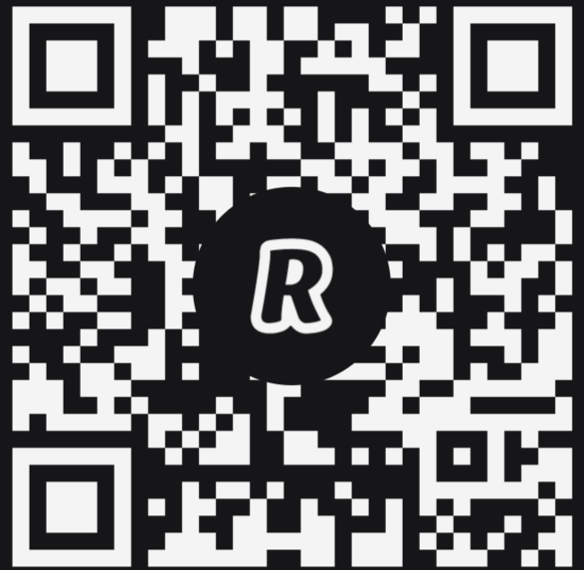

# docker-invat-eu-inveti-si-tu

Resurse de învățare pentru Docker. Materialele reflect experineța de lucru și efortul de a înțelege Docker. Conținuturile preiau informații din site-urile documentației Docker. Multe dintre exemple și explicații sunt preluate din materialele de instruire pe care Bret Fisher (https://www.bretfisher.com/) le-a creat pentru Udemy și Youtube (https://www.youtube.com/c/BretFisherDockerandDevOps).

Aceste texte nu sunt definitive modificându-se ca formă și conținut într-o continuă îmbunătățire pe măsură ce timpul o va permite.

Toate textele și ilustrațiile sunt disponibile oricui sub o licență Creative Commons BY-NC-SA 4.0. Acest lucru înseamnă că puteți lua aceste resurse și puteți face ceva mai mult, mai bine cu mai mare folos pentru voi înșivă, dar fără drept de comercializare și distribuție. Asta înseamnă că le puteți folosi în scop personal sau la clasă pentru a împlini un act de instruire sau cercetare. În cazul în care se realizează profit din activitățile educaționale sau de instruire, creatorul așteaptă o donație generoasă cu deplina recunoaștere. La rândul său, va închide cercul virtuos și va dona o parte la dezvoltarea instrumentelor cu sursă deschisă pe care le folosește.

Rezerv restul drepturilor patrimoniale pentru posibile căi de valorificare, care să susțină dezvoltarea mai departe a resurselor cu o calitate și o dinamică crescută.

Dacă totuși doriți să faceți cunoscute prin distribuire aceste materiale, vă rog să o faceți sub aceeași licență pentru ca cei cărora le-au fost destinate să accepte și să o înțeleagă la rândul lor. Pentru alte utilizări care depășesc cadrul personal sau cel al unui grup restrâns, vă invit să contactați creatorul. Orice donație este binevenită și se va adăuga la plata facturilor și mulțumirea celui care astăzi vi le oferă deschis.

Colecția va fi actualizată foarte des, iar scopul final este înțelegerea tehnologiilor pe care Docker le oferă.

## Oferă suport

Dacă ați găsit utile materialele, puteți sprijini folosind următoarele canale:

- Donații ETH: 0xd4e9e977c4ae9387061ab8f7160666b5c1dc2a2d
- Donații BTC: 1TCT7wcnD5a4sSKnBkudSvc9DMUd9nbLa
- o cafeluță direct pe Revolut la [@nicolaemn](https://revolut.me/nicolaemn) 

## Suport

Dacă ați găsit utile materialele, puteți sprijini folosind următoarele canale:

Donații ETH: 0xd4e9e977c4ae9387061ab8f7160666b5c1dc2a2d
Donații BTC: 1TCT7wcnD5a4sSKnBkudSvc9DMUd9nbLa
