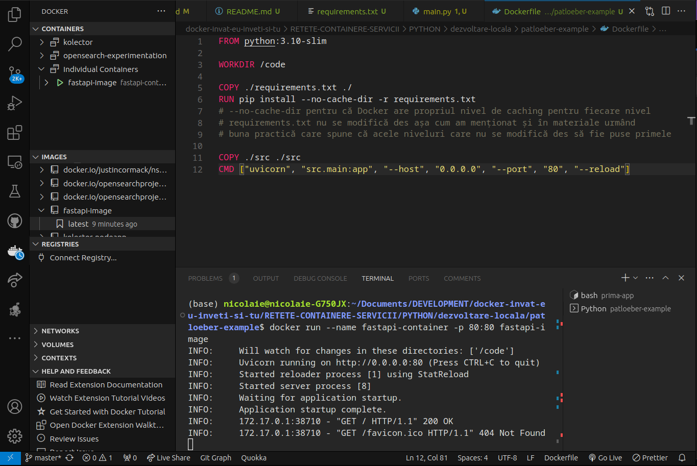
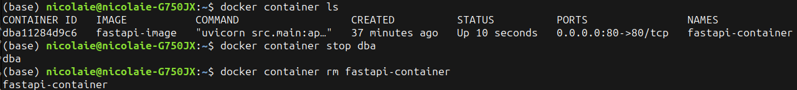
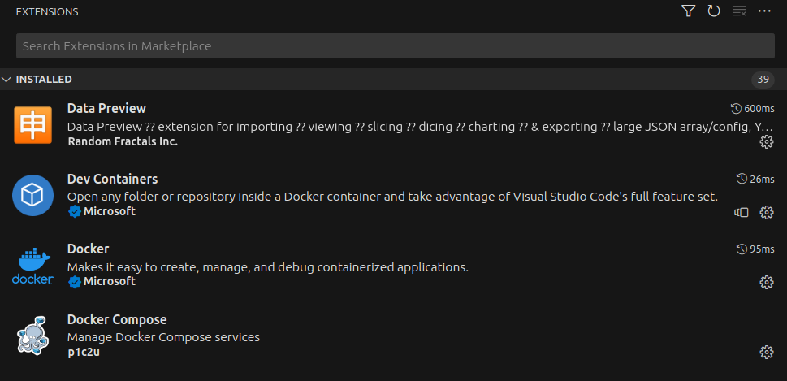
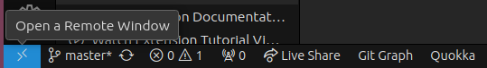
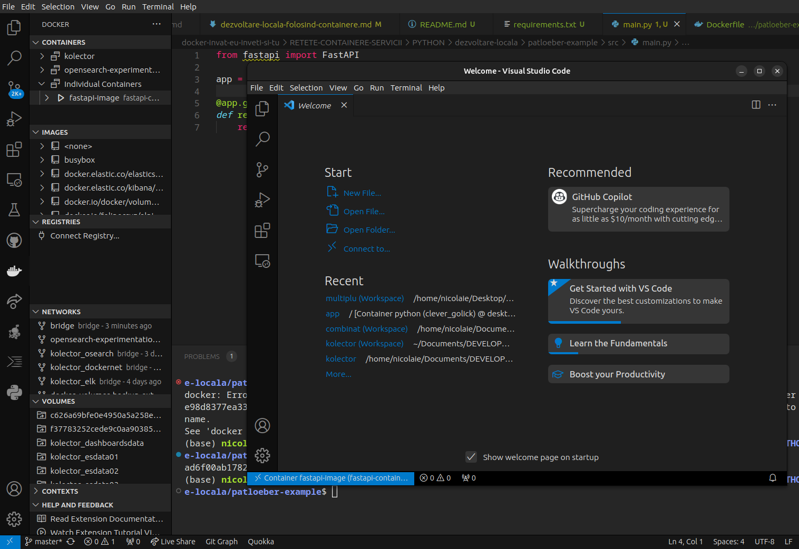
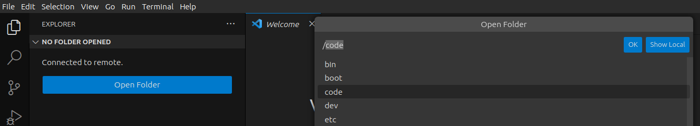
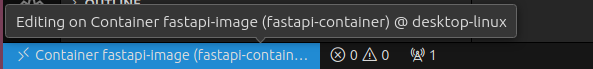

# Exemplu pentru dezvoltarea locală

Acest exemplu este un exercițiu pe care Patrick Loeber îl propune în videoclipul de la adresa https://www.youtube.com/watch?v=6OxqiEeCvMI.

Pentru a construi imaginea, din rădăcina proiectului lansezi comanda: `docker build -t fastapi-image .`.

Pornim crearea containerul în baza noii imagini create cu `docker run --name fastapi-container -p 80:80 fastapi-image`.
Dacă folosești VSCode așa cum fac eu, având instalate pluginul Docker și aplicația Docker Desktop, vei putea avea o perspectivă rotundă asupra ceea ce se petrece. Am pus o captură de ecran mai jos pentru a exemplifica.



Pentru a opri rularea, CTRL + C. Atenție, din diverse motive legate de funcționarea VSCode-ului cu Docker Descktop-ului, pot apărea blocaje. Soluția este repornirea Docker Desktop. Apoi, utilitarul `docker` își revine și se poate proceda la închiderea containerului cu stop.
Rularea containerului în detached mode rezolvă problema: `docker run --name fastapi-container -p 80:80 -d fastapi-image`. Obsevă `-d` pentru *detached* chiar înaintea menționării numelui imaginii care va fi folosite. Pentru a face acest lucru, rulează `docker container ls`, care va afișa toate containerele care rulează. Informația care interesează este `CONTAINER ID`. Având această informație afișată, poți opri containerul care rulează deja cu `docker container stop dba1`. Ceea ce este după stop sunt primele litere și cifre din id-ul de container. Câteva litere și cifre sunt îndeajuns.



Poți șterge containerul existent. Reține faptul că în cazul în care comenzile nu funcționează (terminalul doarme, nu arată niciun output și trebuie să renunți cu CTRL + c), Docker Desktop funcționează defectuos și este nevoie să-l repornești. Pentru a evita cu totul aceste probleme, gestionează containerele numai din Docker Desktop folosind butoanele de pornire, oprire și ștergere de acolo. Folosește linia de comandă doar ca alternativă inevitabilă.

În acest moment, ceea ce vom face este să stabilim o punte, o corespondență între directorul rădăcină al proiectului nostru de pe mașina gazdă, într-un subdirector din container. Facem acest lucru pentru ca ori de câte ori este necesar să modificăm codul sursă pe mașina locală, acestea să se reflecte automat și în container. Pentru a crea această punte, vom crea ceea ce se numește volum. La comanda pe care deja o cunoaștem, adăugăm opțiunea `-v` care crează legătura: `docker run --name fastapi-container -p 80:80 -d -v $(pwd):/code fastapi-image`. Observă faptul că după instrucțiunea `-d` care indică rularea în modul *detached* (adică îți redă controlul în terminal), a apărut `-v` urmat de locul de pe mașina locală: `$(pwd)`, două puncte și locul din container unde se va face legătura/accesul către subdirectorul aplicației noastre de pe mașina locală.
Pentru a fi totul clar, `$(pwd)` este un locțiilor pentru întreaga cale din sistem unde este proiectul nostru. E mai simplu să pui valoarea obținută prin rularea comenzii `pwd` (*print workind directory*) decât să scrii întreaga cale (`/home/nume_user/aplicatii/parloeber-example`). Poi rula în Terminal repede comanda `pwd` și *calea absolută* până la proiectul nostru va fi valoarea returnată. Dacă te-ai lămurit, mergem mai departe prin rularea comenzii `docker run --name fastapi-container -p 80:80 -d -v $(pwd):/code fastapi-image`. Nu uita ca mai înainte să te asiguri că nu rulează containerul. Dacă rulează, oprește-l și șterge-l pentru că rulând comanda nouă, se va crea unul nou care poartă același nume. Dacă cel vechi există, ba mai mult, chiar rulează, se va crea un conflict. Vei primi un mesaj asemănător cu cel de mai jos.

```text
docker: Error response from daemon: Conflict. The container name "/fastapi-container" is already in use by container "1d5d721a25e98d8377ea336879df98980ad8e4a3bd282b6c85d024ee51ce0dc1". You have to remove (or rename) that container to be able to reuse that name.
See 'docker run --help'.
```

Pentru verificare, rularea corectă a comenzi va returna identificatorul unic al containerului creat și pornit. În acest moment, volumul a fost creat și poți modifica codul sursă cu un efect imediat în rularea containerului. O vizită în browser la `http://0.0.0.0/` va afișa ceea ce ai modificat în /src/main.py. Totuși, vei observa faptul că în VSCode, la editarea codului sursă nu ai acces la definițiile funcțiilor, de fapt la mecanismele pe care ți le pune la dispoziție autocomplete-ul, de exemplu. Acest lucru se petrece pentru că, de fapt, instalarea software-ului s-a făcut în container, nu pe mașina locală. Pe mașina locală putem edita codul, dar el, de fapt a fost instalat și rulează în container. 

Pentru a ne bucura de toate beneficiile, cel mai bine ar fi să edităm codul direct în contextul containerului, nu în mașina gazdă. Pentru că am pornit la treabă cu VSCode ca IDE, ne vom asigura că avem instalate două pluginuri foarte importante: `Docker` și `Dev Containers`.



Pentru a merge la codul care rulează în container pentru a-l modifica de acolo, avem opțiunea ca prin acționarea butonului din colțul stânga jos cu cele două săgeți să alegem opțiunea *Attach to Running Container* de unde alegem containerul care rulează.



Ceea ce se va petrece este ca o nouă instanță de VSCode să fie pornită. Aceasta va rula în contextul codului rulat în container pentru că se conectează la acel container.



Odată conectată această nouă instanță de VSCode va trebui să deschizi directorul de lucru. Fii foarte atentă pentru că obiceiul noii instanțe de VSCode este acela de a te îmbia să deschizi `/root`. Modifică ștergând și alegând directorul în care ai ales să pui codul atunci când ai creat volumul. În cazul nostru este chiar în rădăcina sistemului de fișiere al containerului în directorul numit `code`.



Noua instanță de VSCode va detecta și faptul că folosești Python propunându-ți instalarea extensiei specificice. Confirmă pentru o ușoară utilizare. Abia acum ai acces la definițiile funcțiilor, precum și la mecanismul de autocomplete care îți ușurează dezvoltarea codului.
Dacă ai mai multe instanțe de VSCode pornite și nu mai știi care este cea conectată la container, poți să te uiți în colțul stânga jos unde va fi indicată la care container este atașată sesiunea.



Dacă ai terminat treaba, nu uita să oprești containerul. Dacă foolosești Docker Desktop, fă acest lucru de acolo.

## Simplificare cu docker compose

Ceea ce vom face este transformarea comenzii mari cu care cream containerul într-un fișier care să ofere aceleași *instrucțiuni*. Comanda `docker run --name fastapi-container -p 80:80 -d -v $(pwd):/code fastapi-image` poate fi rescrisă într-un fișier precum exemplul de mai jos.

```yaml
services:
 app:
  build: .
  container_name: python-server
  command: uvicorn src.main:app --host 0.0.0.0 --port 80 --reload
  ports:
   - 80:80
  volumes:
   - .:/code
```

Pentru a porni containerul, va trebui să folosim comanda `docker compose up -d`, iar pentru a-l opri `docker compose down`. Ambele comenzi trebuie rulate în directorul proiectului. Ori de câte ori modifici caracteristicile serviciiilor sau adaugi unele noi, trebuie să reconstruiești containerele. Dacă nu ai oprit containerele, fă acest lucru cu `docker compose down` și apoi `docker compose up --build -d`.