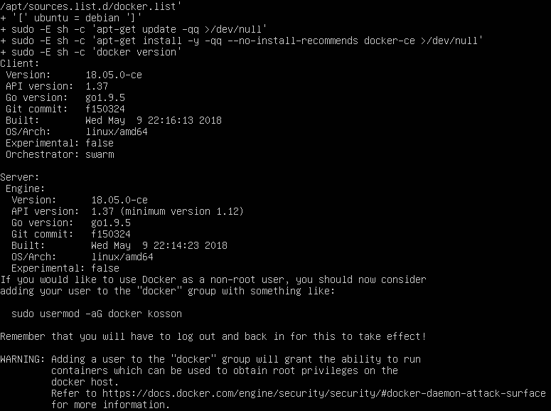

# Instalare Docker

Aceste instrucțiuni sunt pentru server Ubuntu 18.04.

```bash
sudo apt-get install \
    apt-transport-https \
    ca-certificates \
    curl \
    software-properties-common
```

Adaugă cheia GPG

```bash
curl -fsSL https://download.docker.com/linux/ubuntu/gpg | sudo apt-key add -
```

Verifică varianta de Ubuntu pe care o ai instalată.

```bash
lsb_release -cs
```

În acest moment pentru 18.04 merge:

```bash
sudo add-apt-repository "deb [arch=amd64] https://download.docker.com/linux/ubuntu $(lsb_release -cs) stable"
```

În acest moment, final de mai 2017 docker nu are candidat stabil pentru Ubuntu.

```bash
curl -sSL https://get.docker.com | CHANNEL=stable bash
```



Pentru că nu poate fi instalată versiunea stable, am ales versiunea de test, care se instalează: 18-05-0-ce. Soluție prezentată pe [docker-ce package is missing for Ubuntu "Bionic" 18.04 LTS x86_64 \#290 ](https://github.com/docker/for-linux/issues/290).

După instalare, dacă este o mașină de lucru, nu una de producție, cel mai bine ar fi să adaugi utilizatorul sub care operezi la grupul docker.

```bash
sudo usermod -aG docker your-user
```

## Instalare Docker Machine și Docker Compose

Mai întâi instalăm Docker Machine

```bash
base=https://github.com/docker/machine/releases/download/v0.14.0 &&
  curl -L $base/docker-machine-$(uname -s)-$(uname -m) >/tmp/docker-machine &&
  sudo install /tmp/docker-machine /usr/local/bin/docker-machine
```

Versiunea instalată în mai 2018 este 0.14.

Acum este necesară instalarea lui Docker Compose.

```bash
sudo curl -L https://github.com/docker/compose/releases/download/1.21.2/docker-compose-$(uname -s)-$(uname -m) -o /usr/local/bin/docker-compose
```
